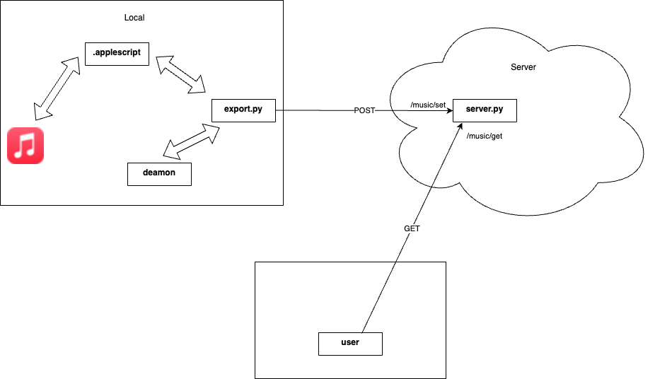
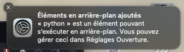

# AppleMusicExporter

AppleMusicExporter is a project designed to### Front:
An implementation example of the API is available in [front-example](front-example):
<!--  -->
 <!-- 710 × 588 -->


## Uninstall:
```bash
cd user
./uninstall.sh
```

# To do:
- commentfrom Apple Music in real time. AppleMusicExporter uses [AppleScript](https://developer.apple.com/library/archive/documentation/AppleScript/Conceptual/AppleScriptLangGuide/introduction/ASLR_intro.html) for interactions with Apple Music.

 <!-- 781 × 437 -->

## Dependencies:MusicExporter

AppleMusicExporter est un projet conçu pour exporter les musiques depuis Apple Music en temps réel. AppleMusicExporter utilise [AppleScript](https://developer.apple.com/library/archive/documentation/AppleScript/Conceptual/AppleScriptLangGuide/introduction/ASLR_intro.html) pour les interactions avec Apple Music.

 <!-- 781 × 437 -->

## Dépendances :

### Back:
 - flask
 - python-dotenv (optional)
 - requests

### User:
 - colorthief
 - python-dotenv
 - requests

## Installation:
### Back:
```bash
git clone https://github.com/NohamR/AM-Exporter.git
cd back
```
Create the .users file with users and their hashed passwords ([.user.example](back/.users.example)).
```bash  
docker build -t amexporter .
```
```bash
docker run -d -p 3005:3005 amexporter
```
Or 
```bash
docker-compose up -d
```

### User:
```bash
git clone https://github.com/NohamR/AM-Exporter.git
cd user
python install -r requirements.txt
```
Create the .env file with the user and their password ([.env.example](user/.env.example)).

Configure [music-exp.plist](user/music-exp.plist) based on the example [music-exp.plist.example](user/music-exp.plist.example):
PYTHON_PATH
WORKING_DIRECTORY
```bash
./install.sh
```


Logs can be found in the working directory:
```bash
cd WORKING_DIRECTORY
tail -f error_logfile.log
tail -f logfile.log
```

### Front :
Un exemple d'implémentation de l'api est disponible dans [front-example](front-example) :
<!--  -->
 <!-- 710 × 588 -->


## Uninstall :
```bash
cd user
./uninstall.sh
```

# To do :
- comment